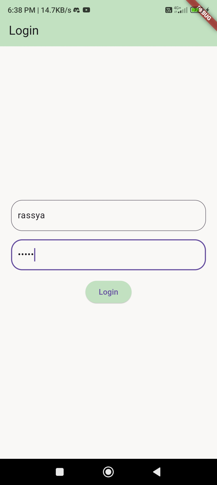
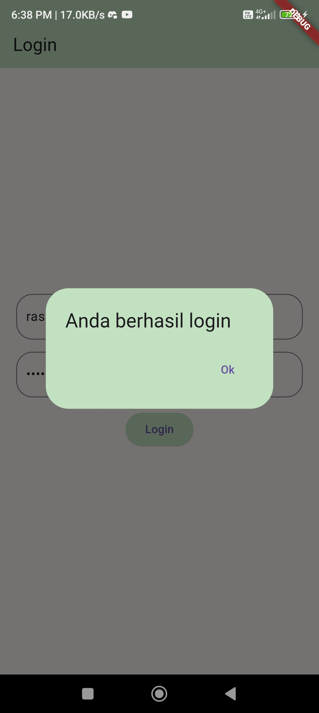
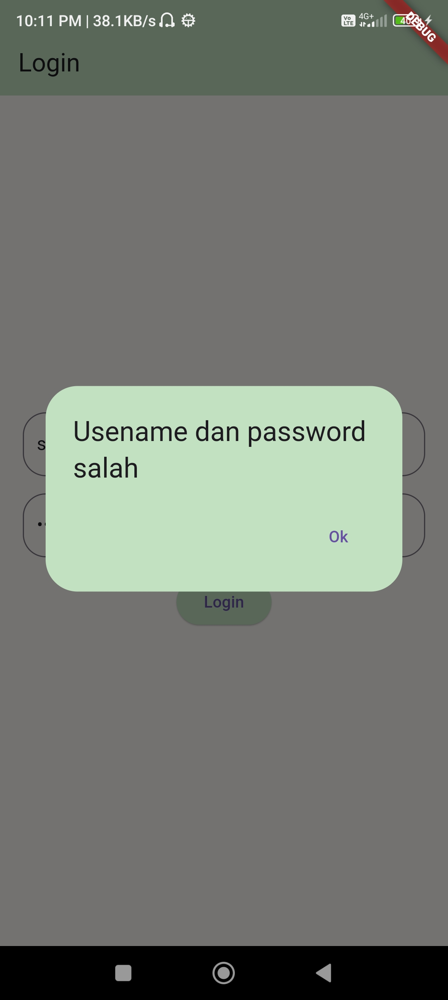
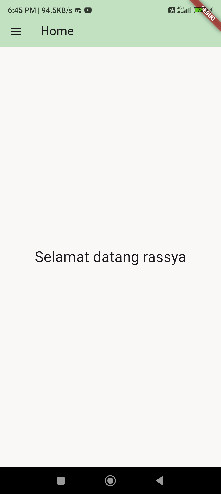
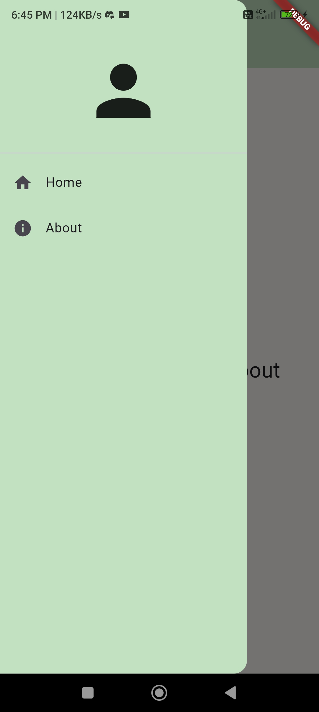
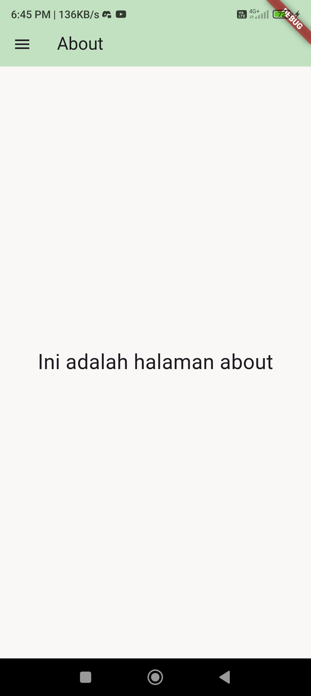

# Tugas 3 Praktikum Mobile

Nama    : Rassya Hafizh Suharjo
NIM     : H1D022068
SHIFT   : A (BARU)
          D (LAMA)

## Penjelasan

1. Ditambahkan dependency 'shared_preferences' pada 'pubspec.yaml' versi '2.0.17' untuk mengambil data login
2. Program pertama kali mengeksekusi dari source code 'main.dart' yang di dalamnya mendefinisikan home sebagai class LoginPage sehingga diarahkan ke 'login_page.dart'.
3. Class LoginPage merupakan statefull widget, sehingga dibuat class private LoginPageState yang mengatur state LoginPage untuk menerima input dan menampilkan ui dengan state yang tidak tetap.
4. Di dalam _LoginPageState terdapat 2 'TextEditingController' yang menerima input dari user yaitu '_usernameController' dan '_passwordController' dengan fungsi yang sesuai namanya.
5. Kedua text controller tersebut dijadikan parameter pada method private '_showinput' dengan parameter (controler,placeholder,dan bool isPassword). Method tersebut mereturn textfield dengan placeholder dan menangkap nilai sesuai controller yang didefinisikan di parameter. Jika isPassword true maka akan membuat form password yang input tersensor.
6. Kemudian terdapat 'ElevatedButton' login yang ketika ditekan akan melakukan pengecekan dengan percabangan if pada kedua controller input. Jika inputan dari kedua controller sesuai, maka akan dieksekusi method '_saveusername' yang menggunakan dependency shared preference untuk menyimpan username dalam bentuk string dari '_usercontroller'.
7. Setelah itu dijalankan method '_showdialog' yang menampilkan alert "anda berhasil login" yang jika ditekan oke akan mengarahkan user ke halaman 'HomePage'.
8. Apabila inputan kedua controller tidak sesuai, maka dijalankan method '_showdialog' yang menampilkan alert "username dan password salah" yang jika ditekan oke akan mengembalikan user ke halaman 'LoginPage'.
9. Pada Class HomePage yang juga merupakan statefulwidget terdapat '_HomePageState' yang mengatur state karena terdapat perubahan pada text yang menampilkan username yang telah terisi saat login.
10. Username didapatkan dari method '_loadusername' yang mendapatkan nilai username dari method 'saveusername' pada LoginPage. Kemudian 'namauser' diset ke nilai yang didapatkan.
11. HomePage menampilkan text "selamat datang (username)" dan menampilkan juga sidebar yang diambil dari SideMenu.
12. Pada sidemenu yang merupakan stateless widget yang tidak berubah statenya terdapat list yang masing - masing mengarahkan ke halaman yang sesuai nama misal home ke HomePage dan About ke AboutPage menggunakan navigator push.
13. Pada halaman about menampilkan kurang lebih sama seperti homepage dengan sidebar dari SideMenu

## Screenshot

